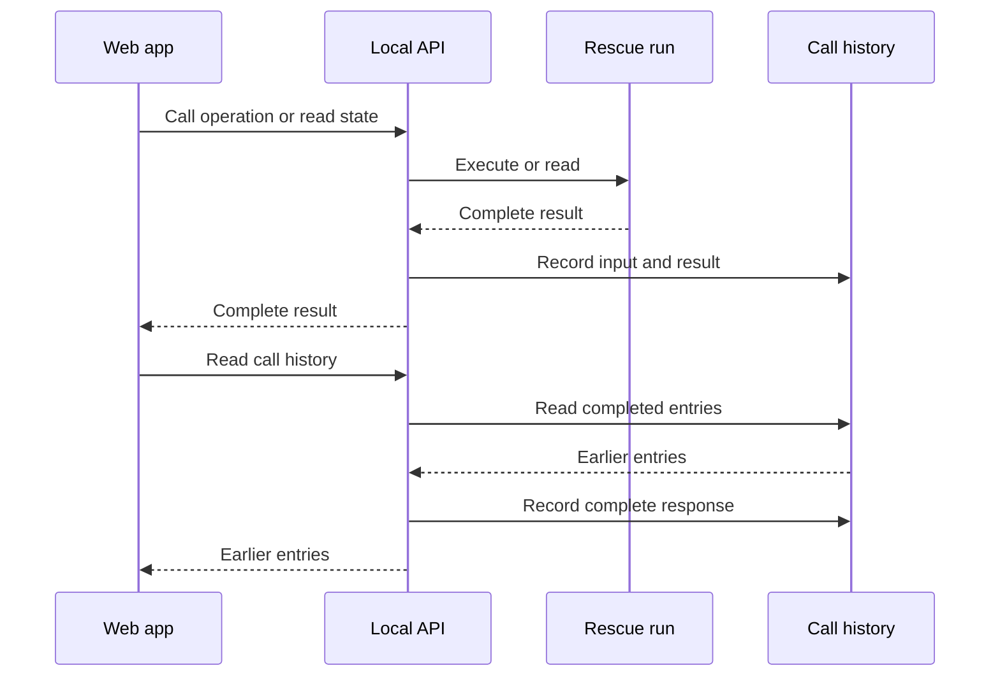

# Rescue HTTP API flow

```mermaid
sequenceDiagram
    participant App as Web app
    participant API as Local API
    participant Run as Rescue run
    participant History as Call history
    App->>API: Call operation or read state
    API->>Run: Execute or read
    Run-->>API: Complete result
    API->>History: Record input and result
    API-->>App: Complete result
    App->>API: Read call history
    API->>History: Read completed entries
    History-->>API: Earlier entries
    API->>History: Record complete response
    API-->>App: Earlier entries
```
